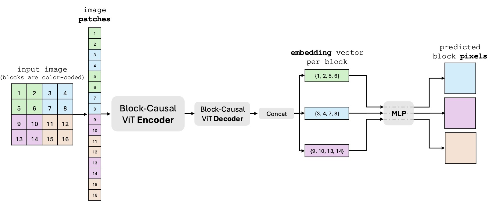

# XTRA: Scalable _and_ Sample-Efficient Auto-Regressive Image Models
Official PyTorch (Lightning) implementation and pretrained/finetuned models of the paper _Scalable _and_ Sample-Efficient Auto-Regressive Image Models_.

## Installation
    conda env create -f environment.yml

## Method

XTRA is an self-supervised auto-regressive vision model that leverages a Block Causal Mask to enhance sample and parameter efficiency. Empirical results demonstrate that this approach enables XTRA to learn abstract and semantically meaningful representations using less data and smaller model sizes. More specifically:

1. XTRA is sample efficient. Although trained on 152x fewer samples (13.1M vs. 2B), XTRA ViT-H/14 outperforms the previous state-of-the-art auto-regressive model of the same size in top-1 average accuracy across 15 diverse image recognition benchmarks. 
1. XTRA is parameter efficient. XTRA ViT-B/16 outperforms auto-regressive models trained on ImageNet-1k in linear and attentive probing tasks, while using 7–16$x fewer parameters (85M vs. 1.36B/0.63B).

<p align="center">

</p>

## Repository Structure

```
.
├── configs                   # '.yaml' configs
│   ├── ablations             #   ablation configs
│   ├── eval                  #   evaluation configs
│   ├── pretrain              #   pre-training configs
├── scripts                   # scheduler scripts
│   ├── lsf                   #   LSF scheduler scripts
│   ├── slurm                 #   Slurm scheduler scripts
├── src                       # source files
│   ├── modules               #   moodule implemtations
│   ├── utils                 #   shared utilities
│   ├── config.py             #   config class
│   ├── dataset.py            #   datasets and data loaders
│   ├── train.py              #   training script
```

## Multi-GPU Training

ViT-B/16:

    sbatch -J xtra_b_in1k ./scripts/slurm/train.sh ./config/pretrain/xtra_b_in1k_pt.yaml

ViT-H/14:

    sbatch -J xtra_h_in21k ./scripts/slurm/train.sh ./config/pretrain/xtra_h_in21k_pt.yaml

## Single-GPU Fine-tuning

See ./config/eval/ for the various models and datasets. Run with the following command:

    python src/train.py --config <chosen_config_file> --pretrained <path_to_pretrained_model>

## Pre-Trained Models

<table>
  <tr>
    <th colspan="1">Architecture</th>
    <th colspan="1">Epochs</th>
    <th colspan="1">Pre-Training Data</th>
    <th colspan="1">Fine-Tuning Data</th>
    <th colspan="2">Download</th>
    <th colspan="1">Attentive Probing Accuracy</th>
  </tr>
  <tr>
    <td>ViT-B/16</td>
    <td>800</td>
    <td>ImageNet-1K</td>
    <td>ImageNet-1K</td>
    <td><a href="https://www.icloud.com/iclouddrive/0b6vEkXThqGdjhstX0uDPD9sg#epoch=799-step=490400">pre-trained</a></td>
    <td><a href="https://www.icloud.com/iclouddrive/03b-50uWgYPs4_VCYH7GUCJ2w#last">fine-tuned</a></td>
    <td>76.8</td>
  </tr>
  <tr>
    <td>ViT-H/14</td>
    <td>100</td>
    <td>ImageNet-21K</td>
    <td>ImageNet-1K</td>
    <td><a href="https://www.icloud.com/iclouddrive/0d00iW62exqNHbTeeGu4OC-9A#mp_rank_00_model_states">pre-trained</a></td>
    <td><a href="https://www.icloud.com/iclouddrive/09368bX2053i40UnBBGBeyCvg#last">fine-tuned</a></td>
    <td>80.9</td>
  </tr>
</table>
